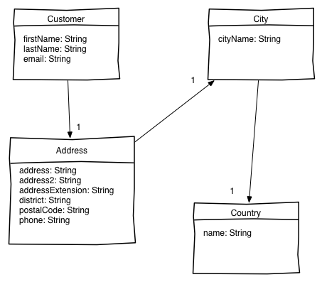

# SPRING DATA JPA

## Foreword

The exercise consists of making the corresponding tests pass.
This will require some adaptation within the tests themselves as well as other related classes (Repository...).

This Hands On has been tested with Eclipse, but any other IDE should work.

## JPA Tests

Basically, the application stores customer locations.
The domain is modeled as follows:

### TODO

The required setup and data set are already provided.
Please complete classes `JpaTest` and `CustomersRepository`. This test suite relies on an embedded H2 database.

   1. Find a customer by its ID (lookup user with id 42)
   1. Find all customers
   1. Get paginated customer results (2nd page [page indices are 0-based], 5 people per page)
   1. Find customers with name compound predicate using explicit queries
